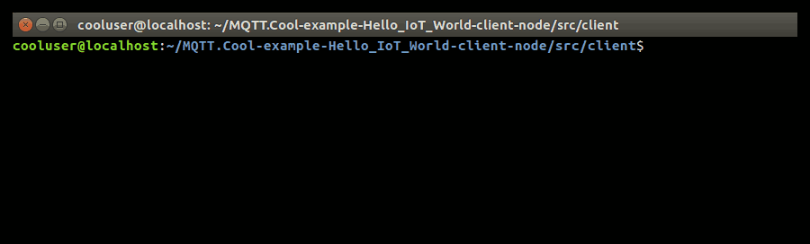
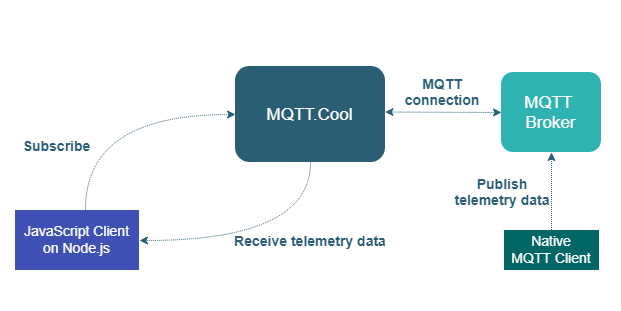

# Hello IoT World Demo - Node.js Client

The **Hello IoT World Demo** is a simple real-time telemetry application based
on MQTT.Cool.



## Details

The **Hello IoT World Demo** uses the
*[MQTT.Cool Node.js Client API](lhttps://mqtt.cool/docs/nodejs-client-sdk/api/index.html)*
to show how MQTT.Cool can be used to send real-time telemetry data through the
Web.

In this demo, a Node.js client application submits two MQTT subscriptions to two
separate topics, in order to receive real-time telemetry metrics from a
hypothetical car, such as Speed and Engine RPM. Upon receiving, data message is
displayed on the console.

Real-time telemetry updates are delivered by a random feed simulator, which is a
*pure* MQTT Node.js client that connects to an MQTT broker, generates simulated
data and publishes them to the target topics at a fixed interval (100 ms).

The demo shows how MQTT.Cool enables an *end-to-end* connection between the
Node.js client application and the MQTT broker, as it takes the role of real
MQTT server proxy by acting as an intermediary for requests coming from the
client and targeted to the broker (in this case, the subscriptions to telemetry
topics), as well as for responses (subscription acks) and Application Messages
(telemetry data) coming from the broker and directed to the client.

### Overall Architecture

Here the overall architecture of the demo:



## Install

If you want to install a version of this demo pointing to your local MQTT.Cool,
follows these steps.

* As prerequisite, this demo needs an up and running MQTT broker. You can choose
whatever MQTT broker you prefer, or may also use one of the available public
broker (an up-to-date list is maintained at
https://github.com/mqtt/mqtt.github.io/wiki/public_brokers).
* Configure an MQTT.Cool instance. Please refer to mqtt.cool web site
[download page](https://mqtt.cool/download/latest-server) to find the MQTT.Cool
download package. MQTT.Cool comes with a set of predefined configurations for
connecting with local MQTT server instances, as well as with the most common
publicly accessible brokers. If you want to provide a new custom configuration,
open the `brokers_configuration.xml` file located under
`<MQTT.COOL_HOME>/conf` and provide a set of entries similar to the
following (please refer to the inline documentation for more in-depth
information on how to configure broker connection parameters):

  ```xml
  ...
  <!-- MQTT broker connection parameters for a local instance
       listening on port 1883, aliased by "mybroker". -->
  <param name="mybroker.server_address">tcp://localhost:1883</param>
  <param name="mybroker.connection_timeout">5</param>
  <param name="mybroker.keep_alive">20</param>
  ...
  ```

* Launch the MQTT.Cool server.
* Download this project.
* If required, install Node.js
* From the `src/client` folder, locally install the client application (based on the [MQTT.Cool Node.js Client API](https://mqtt.cool/docs/nodejs-client-sdk/api/index.html)), by using `npm`:

  ```sh
  $ npm install
  ```

* From the `src/feed` folder, locally install the feed simulator application:

  ```sh
  $ npm install
  ```

## Configure

The demo assumes that the MQTT.Cool server is launched from localhost, but if
you need to target a different server, search in `src/client/client.js`
this line:

```js
const MQTT_COOL_URL = 'http://localhost:8080';
```

and change it accordingly.

Further, the demo will look for the **mosquitto** alias, which is one of the
predefined configurations in `brokers_configuration.xml`. Once more, if you
need to target a different MQTT broker, and provided that relative connection
parameters are already defined as shown above, modify the following line in
`src/client/client.js`:

```js
var mqttClient = mqttCoolSession.createClient('mosquitto');
```

and change it by replacing **mosquitto** with the new alias that maps the MQTT
broker you are going to use.

## Launch

From the `src/feed` folder, run the feed simulator application to publish
simulated telemetry data:

```sh
node feed.js <url_broker>
```

where `url_broker` is the url of the MQTT broker relative to the alias in use in
the client application.

From the `src/client` folder, run the client application:

```sh
$ node client.js
```

and immediately the console reflects updates according to the received
real-time metrics.

## See Also

* [Check out all other demos on MQTT.Cool site](https://mqtt.cool/demos)

## MQTT.Cool Compatibility Notes

* Compatible with MQTT.Cool SDK for Node.js Clients version 1.0.0 or newer.
* Compatible with MQTT.Cool since version 2.0.0 or newver.

